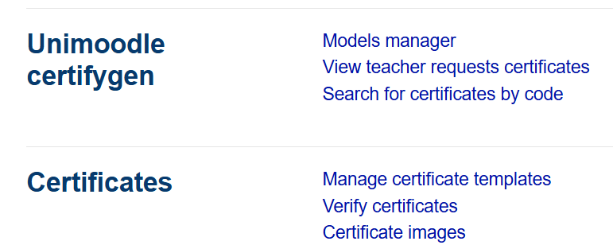

# CertifyGen Companion Plugin

This is the **CertifyGen Companion** plugin for Moodle, developed as part of the **UNIMOODLE** suite. It is designed to complement the **mod_certifyGen** plugin (https://github.com/UNIMOODLE/moodle-mod_certifygen/ and https://moodle.org/plugins/mod_certifygen) by enabling the creation of convenient menu entries in the admin settings.



## Purpose

Moodle does not natively allow activity plugins to create links in the "General" section of the admin settings for users that are not primary administrators. The CertifyGen Companion plugin addresses this limitation by providing a way to generate these menu entries besides "Certificate Tool", ensuring seamless integration and improved accessibility for manager-like users.

## Features

- Adds menu entries in the "General" section of the admin settings.
- Works in conjunction with the CertifyGen plugin to enhance its functionality.
- Fully compatible with Moodle 4.0+.

## Installation

1. Clone or download this repository into the `local` directory of your Moodle installation:
    ```bash
    git clone <repository-url> /var/www/html/moodle405/local/certifygencompanion
    ```
2. Navigate to your Moodle site as an administrator to complete the installation process.

## Requirements

- Moodle 4.0.5 or higher.
- CertifyGen plugin installed and configured.

## License

Kuet is released under the GPL v3 license.

Thank you for considering Kuet for your Moodle platform. We believe it will significantly enhance the engagement and learning experience for your students.

# Credits and funding

KUET was designed by [UNIMOODLE Universities Group](https://unimoodle.github.io/)


KUET was implemented by Moodle's Partner [3iPunt](https://tresipunt.com/)


This project was funded by the European Union Next Generation Program.


## License

This plugin is licensed under the [GNU GPL v3](https://www.gnu.org/licenses/gpl-3.0.html).
